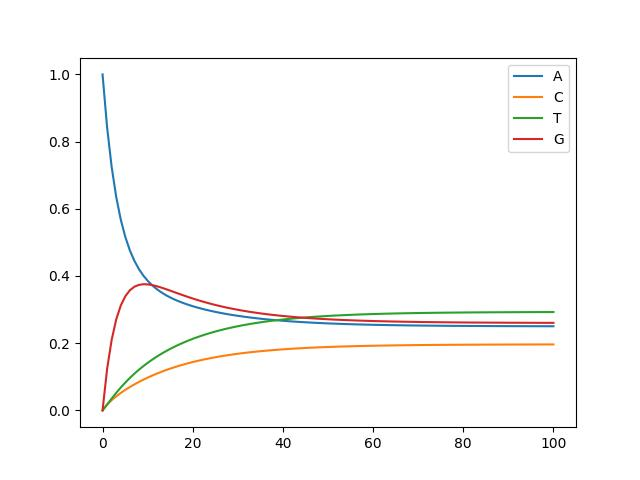
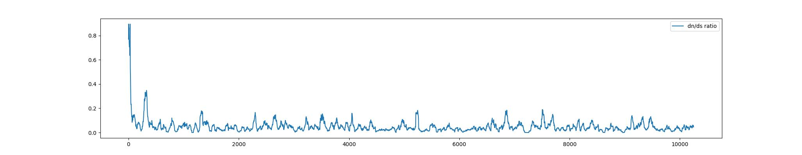
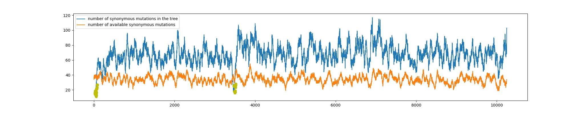

# West Nile virus

This GitHub repository aims to sum up an evolutionary analysis performed on the [West Nile virus](https://en.wikipedia.org/wiki/West_Nile_virus).

This work is part of the Biozentrum Research Summer project 2023, carried out at Richard Neher lab.

## Index

The analysis consists in the following steps:

- Nextstrain workflow on west nile virus
- Analysis of the mutations of the tree
    - GTR model
    - Dn/Ds
    - Research of secondary structures

## Nextstrain Workflow

[Nextstrain](https://nextstrain.org/) is an open-source project to harness the scientific and public health potential of pathogen genome data.

We created a workflow using the West nile virus sequences that can be found on [NCBI virus](https://www.ncbi.nlm.nih.gov/labs/virus/vssi/#/virus?VirusLineage_ss=Viruses,%20taxid:10239&SeqType_s=Nucleotide), selecting for the sequences longer than 8000 basepairs. (Before starting the workflow a preliminary analysis on the sequences was performed, i.e. we roughly aligned and created a tree of the sequences to have a first impression about the data.)

We worked on these [sequences](wnv/data/sequences.fasta) and this [metadata](wnv/data/metadata.csv), using this [reference sequence](wnv/config/reference.gb).

The metadata was not totally suitable for the nextstrain workflow, so we processed it a bit (mainly to make the Division information explicit) through the [metadata_processing.py](wnv/metadata_processing.py) script.

The workflow is in the form of a [Snakefile](wnv/Snakefile), the nextstrain functions that we used are:

- index
- filter: sample a certain maximum number of sequences for each country
- align
- tree
- refine: refines the tree using time data. Unfortunately in our case the time data was not very informative, the diversity of wnv is pretty large and we have only data from the last decades, probably wnv evolution started some centuries ago so it is impossible to infer the root of the tree thanks to time. We set the clock-rate to 0.0004 and we rooted by midpoint.
- ancestral
- translate
- traits: we set Country, Division and Host traits
- export: to allow Auspice to correctly place the Divisions on the map we used the [lat_longs.tsv](wnv/config/lat_longs.tsv) file of the SARS-Cov2 Nextstrain workflow.

A detailed description of each funciton can be found [here](https://docs.nextstrain.org/projects/augur/en/stable/).
You can find the output of each tool in the [result](wnv/results/) folder, these are all the files that we will use in our successive analyses and that were used by auspice to build the graphical representation of the workflow. To look at the finished Nextstrain workflow you should install nextstrain on your device and run the "nextstrain view" function on the [auspice](wnv/auspice/) folder.

## Analysis of the mutations

After having created the nextstrain workflow we shifted our focus on the mutations that have occurred on the West Nile virus sequences. Thanks to Augur, we have all of the estimated ancestral sequences, together with their mutations, of the whole tree, they are stored in the [ancestral_node_data.json](wnv/results/ancestral_node_data.json) file.

Just by loading the tree and going though each node, we can see each mutation ever happened in the history of wnv sequences. In order to understand the evolution that happened in west nile virus we want to look at the regions that are free to change, with no selective pression, a rough way to do so, is to consider only the mutations happening in the third position of each codon.

Each mutation is indicated as starting_nucleotide-position-mutated_nucleotide. We computed the mutation rates of each directed mutation (starting_nucleotide-->mutated_nucleotide), taking special care of the first set of mutations from the root: the root of a nextstrain tree corresponds to the sequence of one of the two branches (the longest one) and all of the mutations are considered in one direction from a child to the other. To have a more coherent count, we should count these mutations as occurring in both directions (1/2 for each direction).

All of the successive analyses were summarised in the [final_script.py](final_script.py), you can run it to see all the passages and you can try to modify the parameters a bit.

### GTR model

At this point we decided to use the mutation counts to build a [substitution model](https://en.wikipedia.org/wiki/Substitution_model#:~:text=Substitution%20models%20are%20used%20to,as%20Bayesian%20inference%20in%20phylogeny.) of the wnv evolution. In phylogeny, estimates of evolutionary distances (numbers of substitutions that have occurred since a pair of sequences diverged from a common ancestor) are typically calculated using substitution models. The model we created has two paramenters: $\Pi$, a vector with the frequences $\pi_i$ of each nucleotide in the sequence and Q a matrix which describes the rate at which bases of one type change into the bases of another type.
On the rows of the matrix there are the rates of mutations from all the bases to a certain base, and on the diagonal we place the negative sum of these probabilities ($q_{ii}=-\sum_{j}q_{ij}$). On the columns we have the mutation rates from a certain base to all the others.

The multiplication of the rate matrix with the vector of base frequences, gives the rate of change of the nucleotide frequences: $\Pi'=Q*\Pi$

These kind of models are just systems of differentials equations, they are used to eastimate the distance between two sequences, the rates contained in the matrix Q, give us a direcction in which the sequence is evolving, by comparing our sequence with another one we can understand how they are placed in time one with respect to the other.

Since we already built the tree we are not interested in estimating the branch length or the evolutionary distance between sequences, we are building this model just to have an understanding of the math underneath phylogeny and to test the equilibrium probabilities of the sequence.

The peculiarity of this GTR is that eventually the nucleotides frequences of the sequence will reach an equilibrium, and we can compute the values at equilibrium. Furthermore, if we assume that the wnv has a long evolutionary history, we can hypothise that its nucleotide frequences (in the synonymous sites) are already at equilibrium (we comuted these probabilities through the [nucleotide_rates.py](nucleotide_rates.py) script).

The equation that we need to solve is the following: $\Pi = e^{Q*t} * \Pi _0$

We can solve this by expressing the matrix Q in its eigenbasis, we find the solution in this trivial state, and then we go back.

If you go thorugh all the passages, you should obtain something like this: $\Pi = A_0 * e^{ \Lambda * t} * V$, where, V is a matrix with the eigenvectors of Q on the columns, D is the diagonalisation of Q and A_0 is the matrix containing the initial conditions (whatever condition we want, each possible initial state will give the same final equilibrium probabilities) expressed in eigenbasis.

The resulting formula is: $\Pi(t)=\sum a^0_i*e^{\lambda _i *t}*v_i$

In order to express the starting conditions in the eigenbasis we have to exploit the left and right eigenvectors of Q and one of their properties, these passages are very well explained in [this document](eigen_decomposition.ipynb)

The final product is wrapped up in the [GTR.py](GTR.py) script, where we have plotted the frequences of the nucleotides in time:

The final frequences that we obtain are: A=0.25, C=0.19, T=0.29, G=0.26.

While the empirical probabilities that we measured on the wnv sequence were: A=0.24, C=0.26, T=0.19, G=0.29.

These results suggest that probably our model is not perfectly able to predict the behaviour of the wnv sequences, this could be due to the fact that on the sequence is acting some kind of natural selection.

### Dn/Ds

More in-depth analyses were carried out on the mutations, a rigorous way of defining synonymous and non-synonymous mutations was implemented in the [mutation_rates.py](mutation_rates.py) script.

To understand if some kind of selection was acting on the sequences we computed the Dn/Ds ratio on the whole sequence. With the [KaKs_ratio.py](KaKs_ratio.py) script, we compute the ratio in a sliding window over the genome.

As you can see from the results the Ka/Ks is very low in the whole sequence, this suggests that every change from the current sequences are very much counterselected, this could explain the differences that we saw between the empirical nucleotide sequences and the ones estimated by the model.

### Secondary structures

Finally, we tried to search for regions in the wnv genome which were poor in synonymous mutations. The regions that have less synonymous mutations are the ones that for some reason, not related to the aminoacid they encode, are strongly conserved. The most common interpretation to these regions is that they are part of important RNA secondary structures, in such case, nucleotides needs to pair and every type of mutation is bad for the hairpin.

With the [secondary_structures.py](secondary_structures.py) script, we compute the number of synonymous mutations (considering the whole wnv tree) in a sliding window over the genome, in the image below, this score is indicated with the blue line.
The orange line indicates the number of positions in the reference sequence that admit a synonymous mutation, again considering a sliding window over the genome.
The yellow dots are the scores of some windows in the genome, that have much less mutations with respect to the rest of the sequence. To spot these sites we considered the score of each window as an independent observation of a gaussian random varaible. We characterised the distribution of the whole sequence by measuring the mean and the standard deviation. The yellow dots corresponds to the realisations of such RV with a p value smaller than 0.01.

The conclusions we can get from this analysis is that there are two sites where likely some secondary structures are happening. You can see how, along the whole sequence, the blue and orange line follow more or less the same pattern of highs and lows, while in the two yellow spots there is a clear divergence. This proves that in such sites there is an actual deficiency of synonymous mutations.

Once having noticed this behaviour, we tried to make some hypotheses:
- the first yellow area is very close to the 5-UTR region of the virus genome, in such region, it is known that secondary sturctures occur. Hence, this signal could be due to the end part of these structures that overlap with the starting codon.
- to explore the second yellow site, spanning more or less from base 5371, to 3619, we tried to simulate the secondary structure profile of the region 5300-5700 of the wnv genome, the result that we obtained are represented below:

It is interesting to notice that indeed the middle part of this sequence seems to be highly involved in a hairpin structure.
